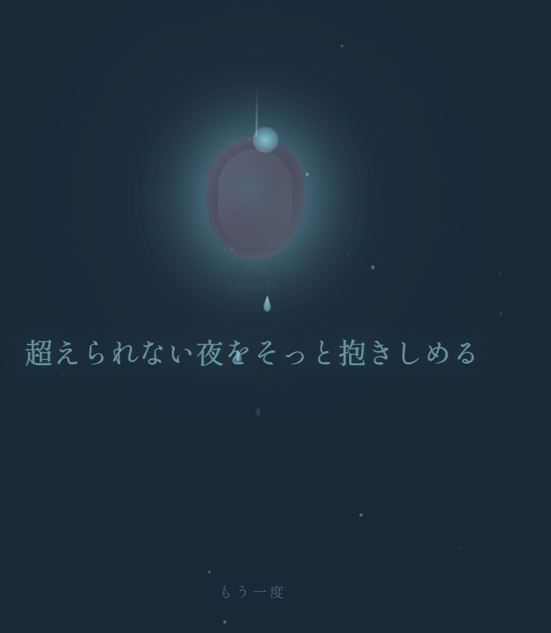
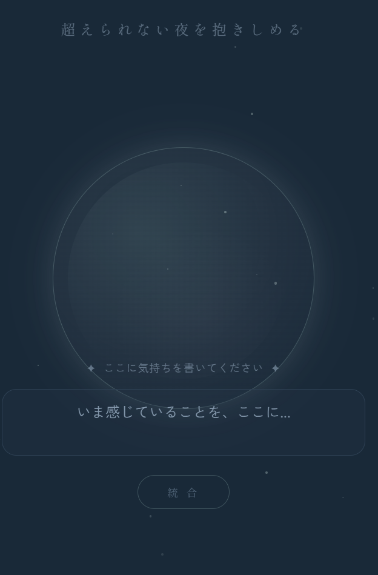

🌃yoruwokoeru - 超えられない夜を そっと抱きしめる

「一生泣かない」と決めて毅然と生きてきた方がいるなら、そんな方へ。
このアプリは、理性の鎧を脱ぎ、言葉にできない涙を宝石（オパール）へと昇華させるための聖域です。

🪐 Concept - コンセプト
経験によって混ざり合い、時には汚れたと感じる感情の色彩。
それらが一本の光の柱へと統合され、最終的には透明な水晶や虹色に輝くオパールへと変わっていく。
反重力（Antigravity）メンタルケア体験。

- 自己受容の調べ: 切なくも温かい世界観。
- 声の灯火: 開発者自身の声による「泣いていいよ」というメッセージ。

 Screenshots
<table>
  <tr>
    <td></td>
    <td></td>
  </tr>
</table>

 ✨ Features - 主な機能
- **Emotional Integration**: ぼやけた感情を視覚化し、光のタワーへと統合するアニメーション。
- **Opal Transformation**: 感情を水色のオパールへと昇華させ、重力から解放する体験。
- **Voice Healing**: 孤独な夜に寄り添う、優しく語りかける音声ガイド。
- **Antigravity UI**: 心の重荷を浮遊させ、視界からそっと離す、あるいは抱きしめるためのインターフェース。

Tech Stack
- **Framework**: [Lovable](https://lovable.app/)
- **Frontend**: React, TypeScript, Tailwind CSS
- **Build Tool**: Vite
- **AI Integration**: Dify (Conceptual Backend)

## 🔗 Live Demo
[yoruwokoeru - Live App](https://ich-vermisse-dich.lovable.app)

---
「超えられない夜を、そっと抱きしめる。あなたは、泣いていい。」
