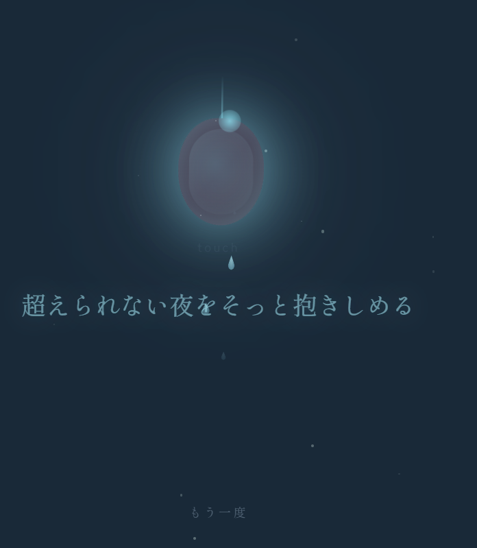
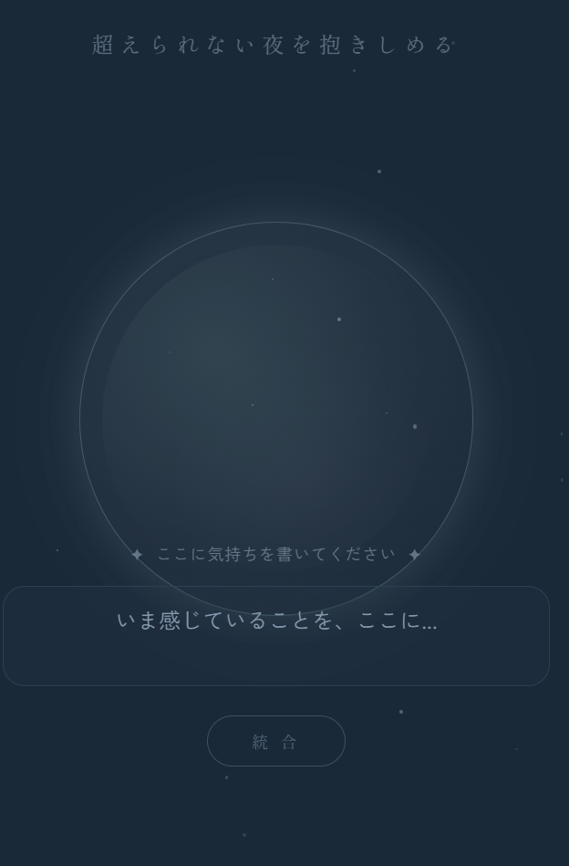

🌃 超えられない夜を そっと抱きしめる

「泣かない」「しなければいけない」と決めて、どこか毅然と生きてきた方がいるなら、そんな方へ。
このアプリは、理性の鎧を脱ぎ、言葉にできない涙を宝石へと昇華させるための聖域です。
言葉にできない想いを　綴ってみてください。モヤモヤした感情を吐き出してくださいね。

## よくある質問

**Q. 書いた内容は安全ですか？**
A. 入力した文字は、お使いの端末の中だけで動きます。
外部への送信も、保存もしていません。
ページを閉じる・更新すると消えます。
アドレス登録不要

🪐 Concept - コンセプト
経験によって混ざり合い、時には汚れたと感じる感情の色彩。
それらが一本の光の柱へと統合され、最終的には透明な水晶や虹色に輝くオパールへと変わっていく。
反重力（Antigravity）メンタルケアの一助になれば幸いです。
オパールは10月の誕生石です✨️
  

 Screenshots
<table>
  <tr>
    <td></td>

  
  

    
  </tr>
</table>

 ✨ Features - 主な機能
- **Emotional Integration**: ぼやけた感情を視覚化し、光のタワーへと統合するアニメーション。
- **Opal Transformation**: 感情を水色のオパールへと昇華させ、重力から解放する体験。
  - **Antigravity UI**: 心の重荷を浮遊させ、視界からそっと離す、あるいは抱きしめるためのインターフェース。

Tech Stack
- **Framework**: [Lovable](https://lovable.app/)
- **Frontend**: React, TypeScript, Tailwind CSS
- **Build Tool**: Vite
  AIは使用していません

💧　Live Demo　💎
(https://ich-vermisse-dich.lovable.app)

---
「超えられない夜を、そっと抱きしめる。あなたは、泣いていい。」
